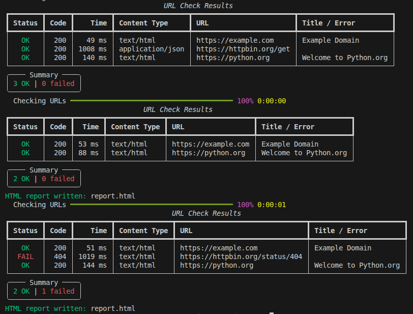
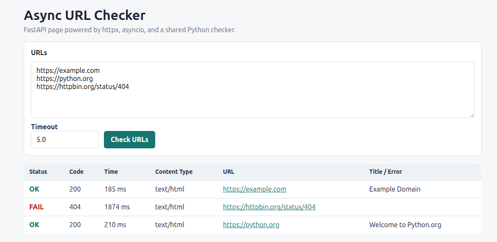

# Python Monitor example with HTTPX + Rich + Asyncio

A small Python project that checks multiple URLs concurrently.



or view web 


It includes:

- a terminal CLI with Rich output
- a FastAPI web page with an HTML form
- an optional static HTML report generated by the CLI

## Install

```bash
cd httpx-rich-asyncio-demo
python -m venv .venv
source .venv/bin/activate
pip install -e .
```

## CLI Usage

```bash
webcheck https://example.com https://httpbin.org/get https://python.org
webcheck --timeout 3 --html-report report.html https://example.com https://python.org
webcheck --from-file urls.txt --html-report report.html
```

## Web Usage

```bash
uvicorn webcheck.web:app --reload
```

Then open:

```txt
http://127.0.0.1:8000
```

## URL File Example

```txt
https://example.com
https://python.org
https://httpbin.org/status/404
```
